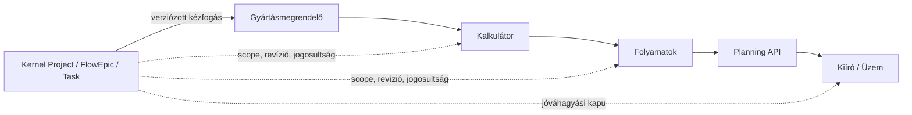

# Doorstar kernelkapcsolat és kézfogási elv

**Dátum:** 2026-07-28  
**Állapot:** kötelező integrációs irányelv; publikus kernel-contractra vár  
**Kapcsolódó kapuk:** `DSCONV-GATE-INSTANCE`, `DSCONV-GATE-HANDSHAKE`,
`DSPLAN-GATE-PLATFORM-CONTRACT`

## Döntés

A Doorstar gyártási lánca nem önálló, párhuzamos projekt- vagy feladatkezelő
rendszer. Minden Doorstar-projekt, kalkuláció, műveleti terv és üzemi kiadás a
kernel Project–FlowEpic–Task modellhez kapcsolódik a publikált platformos
kézfogáson keresztül.

A kapcsolat nem megjelenítési címke és nem lokálisan lemásolt rekord. A
kernel azonosítói, jogosultsági és életciklus-döntései az irányadóak; a
Doorstar csak hivatkozást, a szükséges scope-ot és a saját üzleti kiegészítőit
kezeli.

## Miért alapelv

A rendszer filozófiája szerint egy gyártási művelet nem elszigetelt sor:

```text
üzleti szándék → projekt → epic → feladat → gyártási előkészítés
→ műveleti terv → üzemi kiadás → teljesítési bizonyíték
```

Ez biztosítja, hogy ugyanaz a cél, tulajdonos, scope, felelősség és elfogadási
bizonyíték legyen látható a projektszinttől a műhelyben kiadott információig.

## Kötelező hivatkozási lánc

| Doorstar-elem | Kötelező kernel-kapcsolat | Mire szolgál |
|---|---|---|
| Gyártásmegrendelő / `ProductionOrder` | hitelesített `ProjectReference` | igazolja, melyik projekthez tartozik az igény |
| Termék- és alkatrészkalkuláció | projekt-revízió és opcionális FlowEpic-hivatkozás | rögzíti, milyen scope-hoz tartozik a konfiguráció |
| `OperationCandidate` / műveleti terv | Project + FlowEpic + Task hivatkozás | kimondja, melyik végrehajtható feladat gyártási leképezése |
| Planning-javaslat | hivatkozott scope és bemeneti revíziók | védi, hogy elavult vagy más projekthez tartozó adatból ne készüljön terv |
| Üzemi kiírás / `IssuedWorkPackage` | jóváhagyott terv- és Task-revízió | a műhely csak érvényes, engedélyezett munkát kapjon |
| Partnernek delegált csomag | Collaboration agreement/work package | kétoldalú, tenant-biztonságos scope- és bizonyítékcsere |

Az exact mezőnevek és azonosítóformátumok kizárólag a publikált kernel OpenAPI
és schema alapján válhatnak implementációs részletté. Addig Doorstar nem
találhat ki helyettesítő DTO-t vagy lokális kernel-adatbázist.

## A kézfogás minimális bizonyítéka

Minden, Doorstar és kernel közötti állapotátadásnak a következőket kell
bizonyítania:

1. **Hiteles kontextus:** a tenant és a szereplő a platform által feloldott;
   nincs megbízható kliensoldali `X-Role`, `X-Station` vagy tenant-header.
2. **Kanonikus hivatkozás:** Project/FlowEpic/Task azonosító publikus contract
   szerinti, nem szöveg alapján kitalált megfeleltetés.
3. **Revízió és integritás:** a scope, a terms és szükség esetén a bemeneti
   vagy schema-verzió hash-e ismert; elavult kérés fail-closed.
4. **Jogosultság és láthatóság:** a Doorstar csak a számára engedélyezett
   scope-ot olvassa vagy módosítja; tenantok között RLS védi az adatot.
5. **Korreláció és idempotencia:** a kézfogási esemény visszakövethető, replay
   és duplikált mutáció nem hoz létre második munkát.
6. **Elfogadási bizonyíték:** kiadás vagy külső delegálás csak a megfelelő
   jóváhagyás/acceptance után léphet tovább.

## A négy munkafüzetes lánc illesztése



Az Excel-láncból modernizált Doorstar-adatok csak akkor adhatók át a Planning
API-nak, ha a projekt- és feladatkapcsolat érvényes. A Planning API válasza
sem tehető üzemi kiadássá, ha a kapcsolt Task/scope revíziója időközben
megváltozott vagy a hozzáférés megszűnt.

## Tiltott megoldások

- Doorstar-oldali Project, FlowEpic vagy Task életciklus-másolat mint
  „forrásigazság”.
- Szabad szöveges projekt-/feladatnév mint jogosultsági vagy kapcsolati kulcs.
- Kézzel fenntartott kernel DTO, relatív source-import vagy platformfork.
- Platformos kézfogás pótlása helyi HTTP route-tal, headerrel vagy közvetlen
  cross-tenant adatbázis-írással.
- Üzemi kiírás érvényes projekt-/feladat- és tervrevízió nélkül.

## Kapuk és megvalósítási sorrend

1. A platform publikálja a Project/FlowEpic/Task ownership ADR-t, az Instance
   Context contractot és a kézfogási csomag verzióját/hash-eit.
2. Doorstar validálja a kapott contractot, és konfigurációval/generált klienssel
   feloldja a kernel-hivatkozást.
3. A Gyártásmegrendelő modern megfelelője csak validált `ProjectReference`
   mellett hozható létre vagy módosítható.
4. A Kalkulátor és Folyamatok eredménye hordozza a scope- és forrásrevíziót.
5. A Planning-javaslat shadow módban összevethető a régi Excel-eredménnyel.
6. A Kiíró csak jóváhagyott terv- és Task-revíziót adhat ki az üzemnek.

## Elfogadási kritériumok

- [ ] A Doorstar nem tart fenn alternatív kernel-ownershipet.
- [ ] Egy kiírt üzemi tétel visszavezethető Project, FlowEpic és Task
      hivatkozásra, valamint a bemeneti és tervrevízióra.
- [ ] Stale, revoked, más tenantból érkező vagy nem jogosult kézfogás
      fail-closed.
- [ ] A rendszer publikus, hash-pinnelt contractot és generált klienst fogyaszt.
- [ ] A Doorstar-specifikus kalkuláció/adapter módosítható marad anélkül, hogy
      platformforrást másolna vagy a kernel életciklusát módosítaná.
